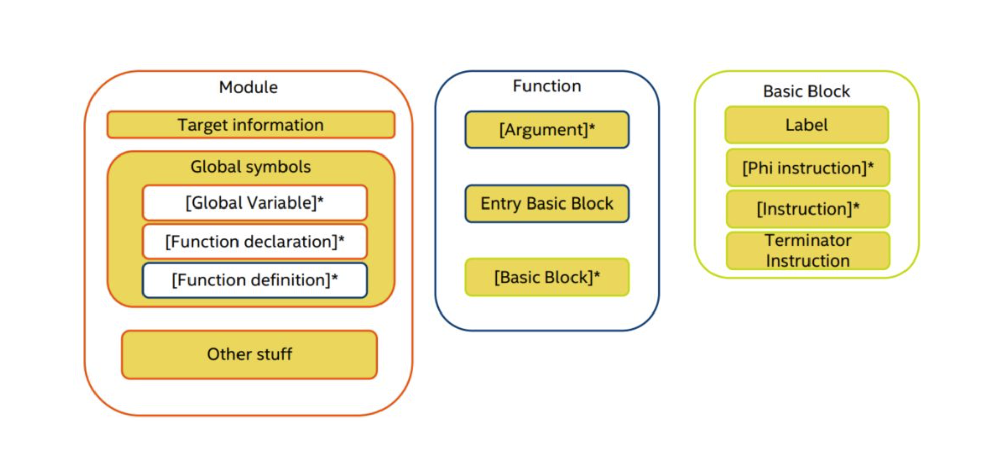

<h1 style='text-align: center'>编译原理设计报告</h1>
<p style='text-align: center'>谢廷浩 3180101944<br/>石昊洋 3180102686</p>


[toc]

# 1. 引言

## 1.1 概述

编译原理课程大作业要求完成一个**编译器**。我们在本次课程大作业中，设计并实现了[rcc](https://github.com/Luke-Skycrawler/rcc)，一个类C语言编译器。该语言是弱类型、命令式且结构化的。我们的编译器基于FLEX进行词法分析、BISON进行语法分析、LLVM实现中间码生成及目标码生成，对输入源码扫描两趟，第一趟为编译预处理（宏定义等），第二趟进行语法和语义分析。rcc支持的语言与C不同之处主要在于：

* 只支持char、int、double，和由它们构成的（多维）数组、结构体，以及数组、结构体间彼此的嵌套组合。**不支持指针等直接地址访问**。

* 不支持包括`jump`、`goto`、`break`、`continue`、`switch`等控制语句。

* `scanf`、`printf`会在编译时自动声明、链接，可以直接使用。注意，`scanf`的调用与C不同，无需通过`&`取变量地址，可以直接使用`scanf("%d", i)`从输入读入变量值。

* `for`循环需要使用类似Pascal的语法：

  ```pascal
  for(i: 0 to n)
  {
  	...
  }
  
  for(i: n downto 0)
  {
  	...
  }
  ```

  循环变量只在`for`语句循环体中有效。

* 不支持前缀表达式

具体的rcc语言语法可以在源代码目录下的`ebnf.txt`查看。

除了基本功能外，我们实现的**进阶主题**包括但不限于：

1. 自定义`struct`类型，可以与基本类型、结构体、基本类型或结构体的数组任意嵌套使用

2. AST抽象语法树可视化

3. 支持宏定义，包括

   ```C
   #define
   #define f(X)
   #ifdef
   #ifndef
   ```

4. 支持简单的错误检测、定位

## 1.2 环境

由于依赖的架构较复杂，建议在Linux、MacOS上编译运行rcc。

建议的依赖版本包括：

* flex 2.5+
* bison 3.0+
* clang 7.0+
* llvm 7.0+

已经成功测试能够编译运行rcc的版本包括：

* flex 2.6.4 + bison 3.0.4 + llvm-12 on Ubuntu 18.04 (x86_64)
* flex 2.5.35 + bison 3.7.6 + llvm-12 on MacOS (x86_64)

## 1.3 文件目录

本次实验提交的文件说明如下：

```
/ #根目录
	--rcc/ #源代码目录
		#rcc主体文件
    --Makefile #编译rcc
    --rcc.l #rcc词法分析flex文件
    --rcc.ypp #rcc语法分析bison文件
    --AST.hpp/cpp #AST树定义、声明
    --CodeGen.h/cpp #LLVM中间代码生成文件
    --RccGlobal.hpp #rcc语法、词法分析用到的全局环境
    --main.cpp #入口文件
    --macro.l #宏定义词法分析flex文件
    --macro.ypp #宏定义语法分析bison文件
    --macro.cpp #宏定义cpp文件
    --ebnf.txt #rcc语言ebnf语法规则说明
    --README.md #README说明
		--test/ #测试文件目录
			--array.c
			--assign.c
			--auto-advisor.c
			--binOp.c
			--declaration.c
			--define.c
			--easy.c
			--for_test.c
			--if_test.c
			--matrix-multiplication.c
			--matrixMul.c
			--naive_test.c
			--naive_test_ast_output.txt #可视化AST树输出
			--qsort.c
			--quicksort.c
			--recursive.c
			--ref_binOp.c
			--scanf_test.c
			--struct.c
			--struct_array.c
			--type_check.c
			--variable_access.c
			--while_test.c
	--report.pdf #该报告
    
```

## 1.4 分工

设计中，抽象语法树构成了一个天然的分工接口，AST以下的工作主要涉及代码生成，AST以上的部分涵盖了语言语法的定义。
但实际上，由于设计一棵表达能力充分又足够简洁的抽象语法树并非易事，在工作中常常有修改迭代；另外由于后端和前端的依赖关系，为了加快进度导致组员二人对词法分析、语法分析、中间码生成、测试都有着差不多的贡献，不展开说明。

# 2. 词法分析

词法分析中，编译器读入源程序字符串，解析后返回token（标记）；返回的token会在下一步被语法分析所利用。

## 2.1 Flex

rcc的词法分析使用flex完成。flex可以匹配用户指定的正则表达式，并结合bison返回token。lex文件由三部分组成：

* 定义区
* 规则区
* 用户子过程区

```
{definitions}
%%
{rules}
%%
{user subroutines}
```

Flex的具体使用、正则语言等理论知识不在此赘述。

## 2.2 具体实现

定义区、用户子过程区不赘述，本节主要展示规则区。根据我们的类C语言（详见ebnf）定义若干token。

首先，处理简单的注释：

```c
"/*".*"*/"		{ count(); }
"//".*\n		{ yylloc->lines(1); }
```

定义的关键字：

```c
"char"			{ count(); return(token::CHAR); }
"double"		{ count(); return(token::DOUBLE); }
"int"			{ count(); return(token::INT); }
"sizeof"		{ count(); return(token::SIZEOF); }
"struct"		{ count(); return(token::STRUCT); }
"if"			{ count(); return(token::IF); }
"else"			{ count(); return(token::ELSE); }
"for"			{ count(); return(token::FOR); }
"to"			{ count(); return(token::INCTO); }
"downto"		{ count(); return(token::DECTO); }
"while"			{ count(); return(token::WHILE); }
"return"		{ count(); return(token::RETURN); }
```

char值（单引号包围单个字符）、int（整数）、double（浮点数）、identifier（字母数字下划线组合）、string literal（双引号包围的多个字符）：

```c
\'.\'			{ count(); yylval->constant = new Nconstant("char", yytext[1]); return(token::CHAR_CONSTANT); }
[0-9]+			{ count(); yylval->constant = new Nconstant("int", atoi(yytext)); return(token::INT_CONSTANT); }
[0-9]+\.[0-9]+	{ count(); yylval->constant = new Nconstant("double", atof(yytext)); return(token::DOUBLE_CONSTANT); }   
[a-zA-Z_][a-zA-Z0-9_]*    { count(); std::string tmp(yytext); yylval->identifier = new Nidentifier(tmp); return(token::IDENTIFIER); }
\"(\\.|[^\\\"])*\"	{ count(); yylval->constant = new Nconstant("string_literal", yytext + 1); return(token::STRING_LITERAL); }
```

在词法分析阶段，我们为它们提前建立AST结点，以方便后续语法分析建树。

运算符：

```c
">>="			{ count(); return(token::RIGHT_ASSIGN); }
"<<="			{ count(); return(token::LEFT_ASSIGN); }
"+="			{ count(); return(token::ADD_ASSIGN); }
"-="			{ count(); return(token::SUB_ASSIGN); }
"*="			{ count(); return(token::MUL_ASSIGN); }
"/="			{ count(); return(token::DIV_ASSIGN); }
"%="			{ count(); return(token::MOD_ASSIGN); }
"&="			{ count(); return(token::AND_ASSIGN); }
"^="			{ count(); return(token::XOR_ASSIGN); }
"|="			{ count(); return(token::OR_ASSIGN); }
">>"			{ count(); return(token::RIGHT_OP); }
"<<"			{ count(); return(token::LEFT_OP); }
"++"			{ count(); return(token::INC_OP); }
"--"			{ count(); return(token::DEC_OP); }
"->"			{ count(); return(token::PTR_OP); }
"&&"			{ count(); return(token::AND_OP); }
"||"			{ count(); return(token::OR_OP); }
"<="			{ count(); return(token::LE_OP); }
">="			{ count(); return(token::GE_OP); }
"=="			{ count(); return(token::EQ_OP); }
"!="			{ count(); return(token::NE_OP); }
";"				{ count(); return(';'); }
("{"|"<%")		{ count(); return('{'); }
("}"|"%>")		{ count(); return('}'); }
","				{ count(); return(','); }
":"				{ count(); return(':'); }
"="				{ count(); return('='); }
"("				{ count(); return('('); }
")"				{ count(); return(')'); }
("["|"<:")		{ count(); return('['); }
("]"|":>")		{ count(); return(']'); }
"."			{ count(); return('.'); }
"&"			{ count(); return('&'); }
"!"			{ count(); return('!'); }
"~"			{ count(); return('~'); }
"-"			{ count(); return('-'); }
"+"			{ count(); return('+'); }
"*"			{ count(); return('*'); }
"/"			{ count(); return('/'); }
"%"			{ count(); return('%'); }
"<"			{ count(); return('<'); }
">"			{ count(); return('>'); }
"^"			{ count(); return('^'); }
"|"			{ count(); return('|'); }
"?"			{ count(); return('?'); }
```

忽略制表符、换行符、空格、其他字符：

```c
[\t ]		{ count(); yylloc->step();}
[\n]		{ count(); yylloc->lines(1);}
.			{  }
```
## 2.3 错误位置跟踪
flex用到的 location 类在bison自动生成的location.hh里定义。location类中定义了文件名、行数和列数。每读入一个token都要对当前位置进行移位。实现的方法是在YY_USER_ACTION定义默认动作，即:
```
yylloc->columns(yyleng);
```
每读入一个token都会根据长度增加列数的偏移量。读到换行符时要调用yylloc->lines(1)下移一行。
# 3. 语法分析

语法分析中，rcc对flex返回的token序列进行解析，根据定义好的CFG构建抽象语法树（AST），供后续步骤生成中间码。语法分析使用了可重入的语法分析器对象，并且设置bison以C++格式生成语法分析器代码。C++的好处在于基类指针和多态继承这两个设计模式，前者可以代替C语言的union并提供更好的抽象，后者可以为抽象语法树生成提供便利。其他的附加优势是C++的vector、string、map等标准库，极大的提高了编程效率，在不考虑编译器自举的情况下是个好选择。

## 3.1 Bison

rcc的语法分析使用Bison完成。与Flex类似，Bison文件的格式如下：

```
  declarations
  %%
  rules
  %%
  programs
```

## 3.2 AST抽象语法树、Bison规则

本节将同时描述AST抽象语法树结点定义，以及相应的bison语法生成规则，以便于理解。如果想查看可视化的AST，可以直接跳到第七章。

AST结点类包括：

```c++
class Node;
class Nprogram;
class NexternalDeclaration;
class Ndeclaration;
class NinitDeclarator;
class NdirectDeclarator;
class NparameterDeclaration;
class Ninitializer;
class NfunctionDefinition;
class NcompoundStatement;
class Nstatement;
class NexprStatement;
class NtypeSpecifier;
class Nexpr;
class NassignExpr;
class NcondExpr;
class NcastExpr;
class NunaryExpr;
class NpostfixExpr;
class Nidentifier;
class Nconstant;
class Nstruct;
```

这是对EBNF语法对应的语法树进一步抽象、简化得到的设计，在保证了一定的可读性的基础上，适当的抽象修改有利于方便地生成中间码。

Bison文件中，我们将利用这些结点，在语法分析的过程中，按照规则构建一棵完整的语法树。

首先需要定义一个保存语法分析值的union变量类型：

```c++
%union {
	Nprogram* program;
	NexternalDeclaration* external_declaration;
	NfunctionDefinition* function_definition;
	NcompoundStatement* compound_statement;
	Ndeclaration* declaration;
	std::vector<Ndeclaration*>* declaration_list;
	std::vector<NinitDeclarator*>* init_declarator_list;
	NtypeSpecifier* type_specifier;
	NinitDeclarator* init_declarator;
	Ninitializer* initializer;
	std::vector<Ninitializer*>* initializer_list;
	NdirectDeclarator* direct_declarator;
	std::vector<NparameterDeclaration*>* parameter_list;
	NparameterDeclaration* parameter_declaration;
	std::vector<Nidentifier*>* identifier_list;
	std::vector<Nstatement*>* statement_list;
	Nstatement* statement; 
	NexprStatement* expr_statement;
	NifStatement* if_statement;
	NforStatement* for_statement;
	NwhileStatement* while_statement;
	Nexpr* expr;
	std::string* assign_op;
	NunaryExpr::UNARY_OP unary_op;
	std::vector<Nexpr*>* argument_expr_list;
	Nconstant* constant;
	Nidentifier* identifier;
	Nstruct* struct_declaration;
	NpostfixExpr *postfix_expr;
}
```

以及相关的token：

```c
%token SIZEOF
%token PTR_OP INC_OP DEC_OP LEFT_OP RIGHT_OP LE_OP GE_OP EQ_OP NE_OP
%token AND_OP OR_OP MUL_ASSIGN DIV_ASSIGN MOD_ASSIGN ADD_ASSIGN
%token SUB_ASSIGN LEFT_ASSIGN RIGHT_ASSIGN AND_ASSIGN
%token XOR_ASSIGN OR_ASSIGN TYPE_NAME
%token CHAR INT DOUBLE
%token STRUCT IF IFX ELSE FOR INCTO DECTO WHILE RETURN

%token<identifier> IDENTIFIER
%token<constant> CHAR_CONSTANT
%token<constant> INT_CONSTANT
%token<constant> DOUBLE_CONSTANT
%token<constant> STRING_LITERAL

%nonassoc IFX
%nonassoc ELSE
```

此外，还需要定义每条生成规则所对应的union值类型，在此不赘述。

### 3.2.1 `Node`

AST结点类与类之间可能存在继承的关系，其中`Node`类是所有结点的基类：

```c++
/**
 * Base class of AST node, for derivation and inheritation
 */
class Node
{
public:
    virtual ~Node() {}
    virtual llvm::Value *codeGen() = 0;
    virtual void printNode(int indent){};
};
```

* `codeGen()`方法负责调用LLVM API生成中间码，声明为虚函数，从而可以利用C++的动态绑定特性，在复杂的继承关系中调用正确的`codeGen()`生成中间码
* `printNode()`方法用于可视化地打印AST

其余结点挑选部分予以介绍。

### 3.2.2 `Nprogram`

```c++
/**
 * `program` node -- the root node!
 * @param external_declaration_list: a vector of `external_declaration` nodes,
 * i.e., `program` consists of function definitions and declarations
 */
class Nprogram : public Node
{
public:
    Nprogram(std::vector<NexternalDeclaration *> &external_declaration_list) : external_declaration_list(external_declaration_list) {}
    void push_back(NexternalDeclaration *external_declaration)
    {
        external_declaration_list.push_back(external_declaration);
    }
    llvm::Value *codeGen();
    virtual void printNode(int indent);

private:
    std::vector<NexternalDeclaration *> external_declaration_list;
};
```

这是一个程序的根结点；在代码生成过程中，我们从该结点访问AST，递归地生成整棵树的中间码。对应的语法规则如下：

```c++
program
    : external_declaration {
		std::vector<NexternalDeclaration*>* tmp = new std::vector<NexternalDeclaration*>();
		tmp->push_back($1);
		$$ = new Nprogram(*tmp);
		root = $$;
	}
	| program external_declaration {
		$$ = $1;
		$1->push_back($2);
		root = $$;
	}
	;
```

### 3.2.3 `NexternalDeclaration`

```c++
/**
 * `external_declaration` node -- either a declaration or a function-definition
 * It's a base virtual node for
 * - `Ndeclaration`
 * - `NfunctionDefinition`
 */
class NexternalDeclaration : public Node
{
};
```

这是一个基类，被

- `Ndeclaration`

 * `NfunctionDefinition`

继承。语法生成规则如下：

```c++
external_declaration
	: function_definition {
		$$ = $1;
	}
	| declaration {
		$1->is_global = true;
		$$ = $1;
	}
	;
```

#### `Ndeclaration`

```c++
/**
 * `declaration` node -- a declaration looks like 'int x = 3', consisting of
 * @param type_specifier: like type_specifier (TODO: storage_type like 'static' and type qualifier like 'const' should be implemented)
 * @param init_declarator_list
 */
class Ndeclaration : public NexternalDeclaration
{
public:
    Ndeclaration(NtypeSpecifier *type_specifier, std::vector<NinitDeclarator *> &init_declarator_list) : type_specifier(type_specifier),
                                                                                                         init_declarator_list(init_declarator_list),
                                                                                                         is_global(false) {}
    Ndeclaration(NtypeSpecifier *type_specifier) : type_specifier(type_specifier), is_global(false) {}
    llvm::Value *codeGen();
    void printNode(int indent);
    bool is_global; // whether it's a global declaration
    void constructStruct(std::string struct_name, std::vector<llvm::Type*> &members);
private:
    NtypeSpecifier *type_specifier; // like 'int' in 'int x = 3'
    std::vector<NinitDeclarator *> init_declarator_list;
};
```

它代表一条声明语句，如：

```c
int x = 3, y;
```

语法规则：

```c
declaration_list
	: declaration {
		std::vector<Ndeclaration*>* declaration_list = new std::vector<Ndeclaration*>;
		declaration_list->push_back($1);
		$$ = declaration_list;
	}
	| declaration_list declaration { $1->push_back($2); $$ = $1; }
	;

declaration
	: type_specifier ';' {
		$$ = new Ndeclaration($1);
	}
	| type_specifier init_declarator_list ';' {
		$$ = new Ndeclaration($1, *$2);
	}
	;

init_declarator_list
    : init_declarator {
		std::vector<NinitDeclarator*>* init_declarator_list = new std::vector<NinitDeclarator*>;
		init_declarator_list->push_back($1);
		$$ = init_declarator_list;
	}
	| init_declarator_list ',' init_declarator {
		$1->push_back($3);
		$$ = $1;
	}
	;

init_declarator
	: direct_declarator { $$ = $1; }
	| direct_declarator '=' initializer { $$->initializer = $3; }
	;

direct_declarator
	: IDENTIFIER {
		$$ = new NdirectDeclarator("", $1);
	}
	| direct_declarator '[' INT_CONSTANT ']' {
		$$ = $1;
		$$->pushIntConstant($3);
		$$->updateType("[]");
	}
	| direct_declarator '[' ']' {
		$$ = $1;
		$$->pushIntConstant(NULL);
		$$->updateType("[]");
	}
	| direct_declarator '(' parameter_list ')' {
		$$ = $1;
		$$->updateType("()");
		$$->setParameterList(*$3);
	}
	/* | direct_declarator '(' identifier_list ')' {
		$$ = $1;
		$$->updateType("()");
		$$->setIdentifierList(*$3);
	} */
	| direct_declarator '(' ')' {
		$$ = $1;
		$$->updateType("()");
	}
	;
```

#### `NfunctionDefinition`

```c++
/**
 * `function_definition` node -- a function definition like 'int f(int x, double y, char z) {...}'
 * or maybe a function call?
 * @param type_specifier: 'int'
 * @param direct_declarator: 'f(int x, double y, char z)'
 * @param declaration_list: what for?
 * @param compound_statement: '{...}'
 */
class NfunctionDefinition : public NexternalDeclaration
{
public:
    NfunctionDefinition(NtypeSpecifier *type_specifier, NdirectDeclarator *direct_declarator, std::vector<Ndeclaration *> &declaration_list, NcompoundStatement *compound_statement) : type_specifier(type_specifier),
                                                                                                                                                                                       direct_declarator(direct_declarator),
                                                                                                                                                                                       declaration_list(declaration_list),
                                                                                                                                                                                       compound_statement(compound_statement) {}
    NfunctionDefinition(NtypeSpecifier *type_specifier, NdirectDeclarator *direct_declarator, NcompoundStatement *compound_statement) : type_specifier(type_specifier),
                                                                                                                                        direct_declarator(direct_declarator),
                                                                                                                                        compound_statement(compound_statement) {}
    NfunctionDefinition(NdirectDeclarator *direct_declarator, std::vector<Ndeclaration *> &declaration_list, NcompoundStatement *compound_statement) : direct_declarator(direct_declarator),
                                                                                                                                                       declaration_list(declaration_list),
                                                                                                                                                       compound_statement(compound_statement) {}
    NfunctionDefinition(NdirectDeclarator *direct_declarator, NcompoundStatement *compound_statement) : direct_declarator(direct_declarator),
                                                                                                        compound_statement(compound_statement) {}
    llvm::Value *codeGen();
    void printNode(int indent);
    // private:
    NtypeSpecifier *type_specifier;               // 'int'
    NdirectDeclarator *direct_declarator;         // 'f(int x, double y, char z)'
    std::vector<Ndeclaration *> declaration_list; // what for?
    NcompoundStatement *compound_statement;       // '{...}'
};
```

它代表一个函数定义，包括函数类型、函数名、参数名及类型、函数定义。这是一个程序的核心，每个rcc程序必须有一个`main()`函数作为入口执行指令。对应的语法规则

```c++
function_definition
	: type_specifier direct_declarator declaration_list compound_statement {
		$$ = new NfunctionDefinition($1, $2, *$3, $4);
	}
	| type_specifier direct_declarator compound_statement {
		$$ = new NfunctionDefinition($1, $2, $3);
	}
	| direct_declarator declaration_list compound_statement {
		$$ = new NfunctionDefinition($1, *$2, $3);
	}
	| direct_declarator compound_statement {
		$$ = new NfunctionDefinition($1, $2);
	}
	;
```

### 3.2.4 `NcompoundStatement`

同样，这也是一个程序的核心——它构成了一个函数的定义主体。

```c++
/**
 * `compound_statement` node -- a compound statement, consisting of
 * @param statement_list: a statement list
 * @param declaration_list: a declaration list
 */
class NcompoundStatement : public Nstatement
{
public:
    NcompoundStatement(const std::vector<Ndeclaration *> &declaration_list, const std::vector<Nstatement *> &statement_list) : statement_list(statement_list),
                                                                                                                               declaration_list(declaration_list) {}
    NcompoundStatement(const std::vector<Ndeclaration *> &declaration_list) : declaration_list(declaration_list) {}
    NcompoundStatement(const std::vector<Nstatement *> &statement_list) : statement_list(statement_list) {}
    NcompoundStatement() {}
    llvm::Value *codeGen();
    void printNode(int indent);

private:
    std::vector<Ndeclaration *> declaration_list;
    std::vector<Nstatement *> statement_list;
};
```

具体地说，它又由若干条declaration、若干条statement组成。语法规则如下：

```c++
compound_statement
	: '{' '}' { $$ = new NcompoundStatement(); }
	| '{' statement_list '}' { $$ = new NcompoundStatement(*$2); }
	| '{' declaration_list '}' { $$ = new NcompoundStatement(*$2); }
	| '{' declaration_list statement_list '}' { $$ = new NcompoundStatement(*$2, *$3); }
	;
```

### 3.2.5 `Nstatement`

statement是任何语言中必不可少的一个元素。

```c++
/**
 * `statement` node -- a base class for `statement`
 */
class Nstatement : public Node
{
public:
    llvm::Value *codeGen();
};
```

众所周知，statement有很多种，包括：

* 表达式语句
* 判定语句
* 循环语句
* 返回语句

语法规则如下：

```c++
statement
	: expr_statement {
		$$ = $1;
	}
	| compound_statement {
		$$ = $1;
	}
	| if_statement {
		$$ = $1;
	}
	| for_statement {
		$$ = $1;
	}
	| while_statement {
		$$ = $1;
	}
	| RETURN expr ';'		{$$=new NreturnStatement($2);}
	| RETURN ';'			{$$=new NreturnStatement(NULL);}
	;
```

下面只挑选expression表达式进行介绍，其余结点较为简单，不赘述。

### 3.2.5 `Nexpr`

表达式expression多种多样，优先级也各不相同。正因如此，这是C++面向对象特性的最佳用武之处——我们可以通过连续的继承记录下不同类型的表达式。

表达式原始EBNF语法规则如下：

```
<expr> ::= <assign_expr>
        | <expr> , <assign_expr>

<assign_expr> ::= <cond_expr>
                | <unary_expr> <assign_op> <assign_expr>

<assign_op>::= =
            | *=
            | /=
            | %=
            | +=
            | -=
            | <<=
            | >>=
            | &=
            | ^=
            | |=

<cond_expr> ::= <logical_or_exprn>
            | <logical_or_expr> ? <expr> : <cond_expr>

<logical_or_expr> ::= <logical_and_expr>
                    | <logical_or_expr> || <logical_and_expr>

<logical_and_expr> ::= <inclusive_or_expr>
                    | <logical_and_expr> && <inclusive_or_expr>

<inclusive_or_expr> ::= <exclusive_or_expr>
                    | <inclusive_or_expr> | <exclusive_or_expr>

<exclusive_or_expr> ::= <and_expr>
                    | <exclusive_or_expr> ^ <and_expr>

<and_expr> ::= <equality_expr>
            | <and_expr> & <equality_expr>

<equality_expr> ::= <relational_expr>
                | <equality_expr> == <relational_expr>
                | <equality_expr> != <relational_expr>

<relational_expr> ::= <shift_expr>
                    | <relational_expr> < <shift_expr>
                    | <relational_expr> > <shift_expr>
                    | <relational_expr> <= <shift_expr>
                    | <relational_expr> >= <shift_expr>

<shift_expr> ::= <additive_expr>
            | <shift_expr> << <additive_expr>
            | <shift_expr> >> <additive_expr>

<additive_expr> ::= <multiplicative_expr>
                | <additive_expr> + <multiplicative_expr>
                | <additive_expr> - <multiplicative_expr>

<multiplicative_expr> ::= <cast_expr>
                    | <multiplicative_expr> * <cast_expr>
                    | <multiplicative_expr> / <cast_expr>
                    | <multiplicative_expr> % <cast_expr>

<cast_expr> ::= <unary_expr>
            | ( <type_specifier> ) <cast_expr>

<unary_expr> ::= <postfix_expr>
            | ++ <unary_expr>
            | -- <unary_expr>
            | <unary_op> <cast_expr>
            | sizeof <unary_expr>
            | sizeof <type_name>

<unary_op> ::= &
            | *
            | +
            | -
            | ~
            | !

<postfix_expr> ::= <primary_expr>
                | <postfix_expr> [ <expr> ]
                | <postfix_expr> ( {<assign_expr>}* )
                | <postfix_expr> . <identifier>
                | <postfix_expr> -> <identifier>
                | <postfix_expr> ++
                | <postfix_expr> --

<primary_expr> ::= <identifier>
                | <constant>
                | <string>
                | ( <expr> )
```

我们首先构建表达式基类：

```c++
/**
 * `expr` node -- an expression looks like 'x = 3, ++y, d[i]--'
 * The class would be inherited by different types of expression classes,
 * while it holds a vector...
 * TODO: The design costs extra non-used space for derived classes, which is not so good...
 * But the current design is plained and conforms to our EBNF!
 */
class Nexpr : public Node
{
public:
    Nexpr() : is_constant(false) {} // default constructor
    Nexpr(std::vector<Nexpr *> &expr_list) : expr_list(expr_list), is_constant(false) {}
    void push_back(Nexpr *expr)
    {
        type = "NULL";
        expr_list.push_back(expr);
    }
    void printNode(int indent);
    llvm::Value *codeGen() = 0;
    std::string type;
    bool is_constant;
private:
    std::vector<Nexpr *> expr_list;
};
```

该基类并不是纯虚类型，

* 一方面，它隐式地代表着逗号表达式，及若干个连续的用逗号连接的表达式。
* 另一方面，它被继承时，`type`成员会被子类用于记录表达式的类型（如"int"）

考虑到设计的合理性，我们并不按照EBNF语法一样连续地继承。更合理的设计方式是：不同结点都继承`Nexpr`的基类。这是因为，在生成中间码的时候我们完全不需要顾及优先级（这是bison需要负责的），因而这样的浅层继承可以在性能、内存上有更好的表现。

例如，二元计算表达式（如`x + y`）：

```c++
/**
 * P op Q
 */
class NbinaryExpr : public Nexpr
{
public:
    NbinaryExpr(const std::string &op, Nexpr *lhs, Nexpr *rhs) : op(op), lhs(lhs), rhs(rhs)
    {
        type = "NULL";
    }
    std::string op;
    llvm::Value *codeGen();
    void printNode(int indent);

private:
    Nexpr *lhs, *rhs;
};
```

赋值表达式：

```c++
/**
 * x = 3
 */
class NassignExpr : public Nexpr
{
public:
    NassignExpr(NpostfixExpr *lhs, std::string assign_op, Nexpr *assign_expr) : lhs(lhs),
                                                                                assign_op(assign_op),
                                                                                assign_expr(assign_expr)
    {
        type = "NULL";
    }
    llvm::Value *codeGen();
    void printNode(int indent);

private:
    NpostfixExpr *lhs;
    std::string assign_op;
    Nexpr *assign_expr;
};
```

特别地，int、double、char或字符串常量也是表达式的一种：

```c++
/**
 * `CONSTANT` node -- a constant
 * @param type: a std::string "char", "int" or "double"
 */
class Nconstant : public Nexpr
{
public:
    Nconstant(const std::string &type, char value)
    {
        is_constant = true;
        this->type = type;
        this->value.char_value = value;
    }
    Nconstant(const std::string &type, int value)
    {
        is_constant = true;
        this->type = type;
        this->value.int_value = value;
    }
    Nconstant(const std::string &type, double value)
    {
        is_constant = true;
        this->type = type;
        this->value.double_value = value;
    }
    Nconstant(const std::string &type, char *value);
    llvm::Value *codeGen();
    void printNode(int indent);
    union Value
    {
        char char_value;
        int int_value;
        double double_value;
        char *string_literal_value;
    } value;
};
```

其余表达式大同小异。

# 4. 语义分析（中间码生成）
## 4.1 LLVM概述

1. 使用了LLVM提供的API，但实践中证明不能完全避免语法错误。
2. llvm 的编程模型很有趣，目标机在这里的抽象是一个拥有无限通用寄存器的计算机，基本上高级语言里的变量都能够被一个寄存器所对应，所有函数的传参也都通过这些寄存器进行，默认不保留在栈中。
3. 诸如常量折叠、运行时环境和寄存器重命名的的步骤被整合进了后续的流水线中，编程者无需费心便可享受一定的免费午餐。

给定一段rcc程序：

```c
int main(int argc, char argv)
{
    int x = 3;
    char y;
    double z = 0.1415;
    x + z;
}
```

经过语义分析，通过LLVM C++ API生成的中间代码表示如下：

```assembly
declare i32 @scanf(...)

declare i32 @printf(i8*, ...)

define i32 @main(i32 %argc, i8 %argv) {
"entry@main":
  %argc1 = alloca i32, align 4
  store i32 %argc, i32* %argc1, align 4
  %argv2 = alloca i8, align 1
  store i8 %argv, i8* %argv2, align 1
  %x = alloca i32, align 4
  store i32 3, i32* %x, align 4
  %y = alloca i8, align 1
  store i8 0, i8* %y, align 1
  %z = alloca double, align 8
  store double 1.415000e-01, double* %z, align 8
  %0 = load i32, i32* %x, align 4
  %1 = load double, double* %z, align 8
  %2 = sitofp i32 %0 to double
  %add = fadd double %2, %1
  ret double %add
}
```

> LLVM的C++ API使用可以参考LLVM官网，再进行转述将毫无意义。在本节，我们将从另一个角度介绍rcc的中间码生成过程。

## 4.2 类型系统

在涉及到变量、表达式的LLVM API时，我们需要复杂的类型系统以进行管理、检查。通常情况下，我们需要知道表达式、变量的类型。因此，我们定义若干方便的类型查询、转换函数：

```c++
inline std::string INT2STRING(int x)
{
    std::stringstream ss;
    ss << x;
    return std::string(ss.str());
}

inline void PRINT_INDENT(int indent, std::string msg = "", bool new_line = 1)
{
    for (int i = 1; i < indent; i++)
        std::cout << "\t";
    if (indent)
        std::cout << "|___";
    if (new_line)
        std::cout << msg << std::endl;
    else
        std::cout << msg;
}

inline std::string GET_TYPE(std::string name)
{
    llvm::Type* type;
    if(topModule->getNamedGlobal(name) != NULL)
    {
        type = global_variables_llvmtype[name];
    }
    else
    {
        if(bindings.find(name) == bindings.end()) return "NULL";
        llvm::AllocaInst *inst = (llvm::AllocaInst *)(bindings[name]);
        if (!inst)
            return "NULL";
        type = inst->getAllocatedType();
    }
    
    if (type->isIntegerTy())
    {
        int num_bit = type->getIntegerBitWidth();
        if (num_bit == 8)
            return "char";
        else if (num_bit == 32)
            return "int";
    }
    else if (type->isDoubleTy())
    {
        return "double";
    }
    else if(type->isStructTy())
    {
        if(((llvm::StructType*)(type))->hasName())
        {
            return ((llvm::StructType*)(type))->getName().str();
        }
        return "struct";
    }
    else if(type->isArrayTy()) // if it's an array (maybe multi-dimensional)
    {
        llvm::Type* tmp = type->getArrayElementType();
        while(tmp->isArrayTy())
        {
            printf("HOLA\n");
            tmp = tmp->getArrayElementType();
        }
        if(tmp->isIntegerTy())
        {
            int num_bit = tmp->getIntegerBitWidth();
            if (num_bit == 8)
                return "char";
            else if (num_bit == 32)
                return "int";
        }
        else if(tmp->isDoubleTy())
        {
            return "double";
        }
        else if(tmp->isStructTy())
        {
            if(((llvm::StructType*)tmp)->hasName())
            {
                return ((llvm::StructType*)tmp)->getName().str();
            }
            return "struct";
        }
    }
    
    return "NULL";
}

inline std::string GET_FUNCTION_TYPE(std::string name)
{
    llvm::Function* function = topModule->getFunction(name);
    if (!function)
    {
        return "NULL";
    }
    if (function->getReturnType()->isIntegerTy())
    {
        int num_bit = function->getReturnType()->getIntegerBitWidth();
        if (num_bit == 8)
            return "char";
        else if (num_bit == 32)
            return "int";
    }
    else if (function->getReturnType()->isDoubleTy())
    {
        return "double";
    }
    return "NULL";
}

inline std::string GET_VALUE_TYPE(llvm::Value* value)
{
    if (!value)
    {
        return "NULL";
    }
    if (value->getType()->isIntegerTy())
    {
        int num_bit = value->getType()->getIntegerBitWidth();
        if (num_bit == 8)
            return "char";
        else if (num_bit == 32)
            return "int";
    }
    else if (value->getType()->isDoubleTy())
    {
        return "double";
    }
    else if(value->getType()->isStructTy())
    {
        if(((llvm::StructType*)(value->getType()))->hasName())
        {
            return ((llvm::StructType*)(value->getType()))->getName().str();
        }
        return "struct";
    }
    return "NULL";
}

inline std::string TRANSLATE_ALLOCAINST2TYPE(llvm::AllocaInst *inst)
{
    if (!inst)
        return "NULL";
    if (inst->getAllocatedType()->isIntegerTy())
    {
        int num_bit = inst->getAllocatedType()->getIntegerBitWidth();
        if (num_bit == 8)
            return "char";
        else if (num_bit == 32)
            return "int";
    }
    else if (inst->getAllocatedType()->isDoubleTy())
    {
        return "double";
    }
    return "NULL";
}

inline llvm::Type *STRING_TO_TYPE(std::string type)
{
    if (type == "int")
        return llvm::Type::getInt32Ty(context);
    else if (type == "double")
        return llvm::Type::getDoubleTy(context);
    else if (type == "char")
        return llvm::Type::getInt8Ty(context);
    else if(struct_info_bindings[type]->struct_type_pointer)
        return struct_info_bindings[type]->struct_type_pointer;
    return NULL;
}

inline std::string TYPE_TO_STRING(llvm::Type* type)
{
    if (!type)
    {
        return "NULL";
    }
    if (type->isIntegerTy())
    {
        int num_bit = type->getIntegerBitWidth();
        if (num_bit == 8)
            return "char";
        else if (num_bit == 32)
            return "int";
    }
    else if (type->isDoubleTy())
    {
        return "double";
    }
    else if(type->isStructTy())
    {
        if(((llvm::StructType*)(type))->hasName())
        {
            return ((llvm::StructType*)(type))->getName().str();
        }
        return "struct";
    }
    return "NULL";
}
```

我们使用字符串`std::string`记录不同类型名，在涉及到LLVM API时，我们可以通过`STRING_TO_TYPE()`函数将字符串转换为对应的LLVM类型指针。

下面以二元表达式为例。

```c++
Value *NbinaryExpr::codeGen()
{
    Value *l = lhs->codeGen(), *r = rhs->codeGen(), *ret = NULL;
    if(l == NULL)
    {
        ERROR("illegal binary expression while $lhs is invalid");
        return NULL;
    }
    if(r == NULL)
    {
        ERROR("illegal binary expression while $rhs is invalid");
        return NULL;
    }
```

首先，我们检查LHS、RHS子结点代码生成值是否为空。如果为空，则代表语义分析中出现了错误，我们即可将此错误递归地传递上去，并打印提醒用户。

随后，我们检查左右手结点的类型是否符合要求，并进行必要的隐式转换（如double + int中，int会被转换成double再进行加法）。如果不符合要求，则记录该结点类型为错误error，并屏蔽掉高层的错误提醒。

```c++
		std::string lhs_type = lhs->type;
    std::string rhs_type = rhs->type;

    // If one is double, the op should also be a double op
    if (lhs_type == "double" && rhs_type == "double")
        type = "double";
    else if(lhs_type == "int" && rhs_type == "double") // convert int -> double
    {
        type = "double";
        l = builder.CreateSIToFP(l, Type::getDoubleTy(context));
    }
    else if(lhs_type == "double" && rhs_type == "int") // convert int -> double
    {
        type = "double";
        r = builder.CreateSIToFP(r, Type::getDoubleTy(context));
    }
    else if(lhs_type == "int" && rhs_type == "int")
        type = "int";
    else if(lhs_type == "char" && rhs_type == "char")
    {
        type = "int";
        l = builder.CreateIntCast(l, Type::getInt32Ty(context), false);
        r = builder.CreateIntCast(r, Type::getInt32Ty(context), false);
    }
    else if(lhs_type == "char" && rhs_type == "int") // convert char -> int
    {
        type = "int";
        l = builder.CreateIntCast(l, Type::getInt32Ty(context), false);
    }
    else if(lhs_type == "int" && rhs_type == "char") // convert char -> int
    {
        type = "int";
        r = builder.CreateIntCast(r, Type::getInt32Ty(context), false);
    }
    else // check for type error
    {
        type = "error";
        if (lhs_type != "error" && rhs_type != "error") // Blocking cascade error
            ERROR("type error in binary expression $lhs " + op + " $rhs : $lhs is \'" + lhs_type + "\' while rhs is \'" + rhs_type + "\'");
        return NULL;
    }
```

自此，我们可以进行binary operation了：

```c++
if (type == "int" || type == "char")
    {
        Value *constant_zero;
        if(type == "int" || type == "char") constant_zero = ConstantInt::get(Type::getInt32Ty(context), 0);
        // else if(type == "char") constant_zero = ConstantInt::get(Type::getInt8Ty(context), 0);

        switch (op[0])
        {
        case '+':
            return builder.CreateAdd(l, r);
        case '-':
            return builder.CreateSub(l, r);
        case '*':
            return builder.CreateMul(l, r);
        case '/':
            return builder.CreateSDiv(l, r);
        case '%':
            return builder.CreateSRem(l, r);
        case '&':
            if (op.size() == 1)
                return builder.CreateAnd(l, r);
            else
            {
                ret = builder.CreateICmpUGT(builder.CreateAnd(l, r), constant_zero);
                ret = builder.CreateIntCast(ret, Type::getInt32Ty(context), false);
                return ret;
            }
        case '|':
            if (op.size() == 1)
                return builder.CreateOr(l, r);
            else
            {
                ret = builder.CreateICmpUGT(builder.CreateOr(l, r), constant_zero);
                ret = builder.CreateIntCast(ret, Type::getInt32Ty(context), false);
                return ret;
            }
        case '^':
            return builder.CreateXor(l, r);
        case '<':
            if (op.size() == 1)
            {
                ret = builder.CreateICmpSLT(l, r);
                ret = builder.CreateIntCast(ret, Type::getInt32Ty(context), false);
                return ret;
            }
            else if (op[1] == '=')
            {
                ret = builder.CreateICmpSLE(l, r);
                ret = builder.CreateIntCast(ret, Type::getInt32Ty(context), false);
                return ret;
            }
            else if (op[1] == '<')
            {
                return builder.CreateShl(l, r);
            }
        case '>':
            if (op.size() == 1)
            {
                ret = builder.CreateICmpSGT(l, r);
                ret = builder.CreateIntCast(ret, Type::getInt32Ty(context), false);
                return ret;
            }
            else if (op[1] == '=')
            {
                ret = builder.CreateICmpSGE(l, r);
                ret = builder.CreateIntCast(ret, Type::getInt32Ty(context), false);
                return ret;
            }
            else if (op[1] == '>')
                return builder.CreateAShr(l, r);
        case '=':
        {
            ret = builder.CreateICmpEQ(l, r);
            ret = builder.CreateIntCast(ret, Type::getInt32Ty(context), false);
            // ret = builder.CreateUIToFP(ret, Type::getDoubleTy(context));
            // ret = builder.CreateFPToSI(ret, Type::getInt32Ty(context));
            return ret;
        }
        case '!':
        {
            ret = builder.CreateICmpNE(l, r);
            ret = builder.CreateIntCast(ret, Type::getInt32Ty(context), false);
            return ret;
        }
        default:
        {
            ERROR("invalid binary operator \'" + op + "\' for type \'int\'", 0);
            return NULL;
        }
        }
    }
    else if(type == "double")
    {
        switch (op[0])
        {
        case '+':
            return builder.CreateFAdd(l, r, "add");
        case '-':
            return builder.CreateFSub(l, r, "sub");
        case '*':
            return builder.CreateFMul(l, r, "mult");
        case '/':
            return builder.CreateFDiv(l, r, "div");
        case '>':
            if (op.size() == 1)
            {
                ret = builder.CreateFCmpUGT(l, r, "");
                ret = builder.CreateIntCast(ret, Type::getInt32Ty(context), false);
                return ret;
            }
            else if (op[1] == '=')
            {
                ret = builder.CreateFCmpUGE(l, r, "");
                ret = builder.CreateIntCast(ret, Type::getInt32Ty(context), false);
                return ret;
            }
            else
            {
                ERROR("shift operator \'>>\' not applicable to type \'double\'!\n");
                return NULL;
            }
        case '<':
            if (op.size() == 1)
            {
                ret = builder.CreateFCmpULT(l, r, "cmp");
                ret = builder.CreateIntCast(ret, Type::getInt32Ty(context), false);
                return ret;
            }
            else if (op[1] == '=')
            {
                ret = builder.CreateFCmpULE(l, r, "cmp");
                ret = builder.CreateIntCast(ret, Type::getInt32Ty(context), false);
                return ret;
            }
            else
            {
                ERROR("shift operator \'<<\' not applicable to type \'double\'!\n");
                return NULL;
            }
        default:
            ERROR("invalid binary operator \'" + op + "\' for type \'double\'", 0);
            return NULL;
        }
    }
    return ret;
}
```

注意：需要根据加法等操作的类型，选择整型/浮点API。另外，`||`、`&&`、`<=`等运算中，需要将1-bit的Cmp结果转换为32位整形结果，以符合我们设计的语言类型（没有布尔类型）。

## 4.3 变量、数组、结构体
llvm里提供了功能强大的指针接口`CreateGEP()`，是数组和自定义结构的基础。

如前所述，llvm中变量都是存在寄存器里的，在变量定义时要为其分配空间。如果是数组类型，则需要先调用`CreateGEP()`分配特定大小的块。目前编译器的运行时环境基于栈，没有动态分配的堆空间。

### 4.3.1 绑定

毫无疑问，我们需要在变量、数组、结构体声明后保存它们相关的信息，也就意味着我们需要使用绑定表保存它们。在rcc中，全局作用域下有若干查找表，分别记录：

* 变量名对应的llvm指针
* 结构名对应的相关数据
* 全局变量对应的类型信息

```c++
std::map<std::string, void*> bindings;
std::map<std::string, StructInfo*> struct_info_bindings;
std::map<std::string, std::string> global_variables_type;
std::map<std::string, llvm::Type*> global_variables_llvmtype;
```

### 4.3.2 变量构建与访问

正如常见的汇编语言，LLVM中间表示通过store保存变量值、load取出变量值。例如，在声明一个double变量时：

```c++
if (type == "double")
{   
  allocation = builder.CreateAlloca(Type::getDoubleTy(context), NULL, op);
  if(!allocation)
  {
    ERROR("unable to allocate for variable \'" + op + "\' of type \'" + type + "\'");
    return NULL;
  }
  if (it->initializer)
    builder.CreateStore(initializer_value, allocation);
}
```

`builder.CreateAlloca()`会生成一条为变量申请地址的指令，`builder.CreateStore()`会生成一条向变量地址store值的指令。在申请地址成功后，我们通过

```c++
bindings[op] = allocation;
```

记录该identifier对应的llvm指针。

同理，取变量值时：

```c++
// get access
Value *addr = getAccess();
if(addr == NULL)
{
  ERROR("undeclared single variable \'" + op + "\'");
  return NULL;
}
// load variable
Value* ret = builder.CreateLoad(STRING_TO_TYPE(type), addr);
return ret;
```

在通过`getAccess()`获取identifier对应的地址后，通过`builder.CreateLoad(STRING_TO_TYPE(type), addr)`生成一条取变量值的指令。其中，`getAccess()`通过

```c++
addr = (Value*)(bindings[op])
```

查询符号表获取变量的指针。

全局变量与本地变量稍有不同。在声明时：

```c++
allocation = new llvm::GlobalVariable(*topModule, STRING_TO_TYPE(type), false, llvm::GlobalValue::ExternalLinkage, (Constant*)(initializer_value), op);
```

通过

```c++
global_variables_type[op] = type; // manually bind
global_variables_llvmtype[op] = llvm_type; // manually bind
```

手动记录全局变量的类型信息。取地址时不依赖于我们自定义的map，可以通过

```c++
topModule->getNamedGlobal(op)
```

得到全局变量的指针，并作为`builder.CreateLoad`的地址参数。

### 4.3.3 数组构建

数组在LLVM有专门的类型，`ArrayType`。多维的数组类型可以通过以下方式循环地定义：

```c++
llvm::Type* tmp_type = STRING_TO_TYPE(type);
ArrayType* array_type;
for(auto constant = it->dimensions.rbegin(); constant != it->dimensions.rend(); constant++)
{
  if (*constant)
  {
    array_type = ArrayType::get(tmp_type, (*constant)->value.int_value);
    tmp_type = array_type;
  }
}
```

同样地，在生成变量申请地址指令时，我们使用类似的API：

```c++
allocation = builder.CreateAlloca(array_type, NULL, op);
```

### 4.3.4 结构体构建

rcc允许用户自定义结构体。结构体结点`Nstruct`在codeGen时会做如下的事情：

```c++
llvm::Value *Nstruct::codeGen()
{
    /**
     * This codeGen() return nothing! It just constructs the user defined type
     * and save the info in the global map `struct_info_bindings`
     */
    auto struct_type = llvm::StructType::create(context, name); // create an opaque type
    if(struct_info_bindings[name] != NULL)
    {
        ERROR("struct type \'" + name + "\' already defined");
        return NULL;
    }
    struct_info_bindings[name] = new StructInfo(struct_type); // create a new struct info in map
    
    std::vector<llvm::Type*> members; // the vector to hold all types
    for(auto it: *content) // traverse all declarations
    {
        it->constructStruct(name, members);
    }
    struct_type->setBody(members); // update the LLVM struct type's body
    
    return NULL;
}
```

即递归地遍历子结点，在全局的`struct_info_bindings`表中记录自定义类型的信息，包括：

```c++
class StructInfo {
public:
    StructInfo(llvm::StructType* struct_type_pointer):len(0), struct_type_pointer(struct_type_pointer){}
    llvm::StructType* struct_type_pointer;
    int len; // number of members
    std::map<std::string, int> name_offset_map; // mapping names of members to offsets
    std::map<std::string, std::string> name_type_map; // mapping names of members to types (string)
    std::map<std::string, llvm::Type*> name_llvmtype_map; // mapping names of members to LLVM types
};
```

* 结构体llvm类型指针
* 成员数量
* 成员名与偏移对照表
* 成员名与类型名对照表
* 成员名与llvm类型指针对照表

通过这样一个map，我们可以在任何时候了解一个struct全部信息！

在生成申请地址指令时，struct和普通的int、double、char类型一模一样：

```c++
else // user defined struct type
{
  allocation = builder.CreateAlloca(llvm_type, NULL, op);
  if(!allocation)
  {
    ERROR("unable to allocate for variable \'" + op + "\' of type \'" + type + "\'");
    return NULL;
  }
  if (it->initializer)
  {
    ERROR("initializing a struct type variable is not allowed");
    return NULL;
  }
}
```

### 4.3.5 数组、结构体访问

对于数组、结构体的访问则需要在AST的结点上进行一番设计。一些复杂的嵌套定义可能会让访问一个结构体成员的过程非常崎岖，例如：

```c++
x[3].y.z[num1 + num2].member
s.a[14].p
```

访问成员的表达式是一条后缀表达式(postfix expression)。我们的解决办法是：每个postfix expression结点拥有一个`std::vector<expr*>`，用于按顺序记录右手侧的表达式（可能用于索引数组成员，也可能是一个struct成员名字）。在访问这样一个最终的成员时，我们可以遍历该vector，利用llvm的`CreateGEP` API依次取出每一层的指针，直到找到最右手侧的成员。

> 这样的设计下，我们可以将struct和array一视同仁。

`getAccess()`取数组/结构体成员变量指针主要步骤可以通过一个for循环完成：

```c++
for(auto it: expr)
{
  Value* array_ref = it->codeGen();
  if(array_ref) // array element
  {
    indices.push_back(array_ref);
    if(superior_llvm_type->isArrayTy())
      superior_llvm_type = ((llvm::ArrayType*)superior_llvm_type)->getElementType(); // update superior type name
    else
    {
      ERROR("illegal access a struct vairable's member that is not of an array type");
      return NULL;
    }
  }
  else // struct member
  {
    Nidentifier* tmp = (Nidentifier*)it;
    std::string& member_name = tmp->name;
    std::string superior_type = TYPE_TO_STRING(superior_llvm_type);
    if (struct_info_bindings.find(superior_type) == struct_info_bindings.end())
    {
      ERROR("No such struct type \'" + superior_type + "\'");
      return NULL;
    }
    if (struct_info_bindings[superior_type]->name_offset_map.find(member_name) == struct_info_bindings[superior_type]->name_offset_map.end())
    {
      ERROR("No such member \'" + member_name + "\' in struct type \'" + superior_type + "\'");
      return NULL;
    }

    int member_offset = struct_info_bindings[superior_type]->name_offset_map[member_name];
    indices.push_back(ConstantInt::get(Type::getInt32Ty(context), member_offset));

    superior_llvm_type = struct_info_bindings[superior_type]->name_llvmtype_map[member_name]; // update superior type name
  }
}
```

该过程是在构建一个`indices`数组，依次记录访问的offsets。例如，访问`a[3][4]`成员的indices就是：

```
indices = {0, 3, 4}
```

结构体也是类似的，对于

```c++
struct A {
  int x;
  double y;
  char z;
};
struct A tmp; 
```

访问`tmp.y`对应的indices就是

```
indices = {0, 1}
```

最后，通过`CreateGEP`获取指针并返回即可。

```c++
llvm::Value* member_ptr = builder.CreateGEP(addr, indices, "memberptr");
return member_ptr;
```

同样地，对于这个指针，可以通过`CreateStore`写值、`CreateLoad`读值

## 4.4 布局

LLVM的布局如下图所示。



* 整个程序都基于一个module；一个module内有全局变量、函数定义、函数声明等信息
* 每个函数有对应的function结构，包含参数、入口basic block、其他basic block等
* Basic block是CFG（调用流图）里的概念，指一段单入口单出口的代码单元。LLVM提供了这一抽象，进行循环、分支和函数主体都要创建basic block来实现。

### 4.4.1 函数

【SHY写】

### 4.4.2 控制语句

控制语句的API使用可以参考[LLVM官方教程](https://llvm.org/docs/tutorial/MyFirstLanguageFrontend/LangImpl05.html)。

一个if语句的中间表示图如下：


首先，生成`if (cond_val)`的条件值`cond_val`代码：

```c++
Value *cond_val = cond_expr->codeGen();
cond_val = builder.CreateFCmpONE(cond_val, ConstantFP::get(context, APFloat(0.0)), "ifcond");
```

定义若干BasicBlock：

```c++
BasicBlock *then_bb = BasicBlock::Create(context, "then", the_function);
BasicBlock *else_bb = BasicBlock::Create(context, "else");
BasicBlock *merge_bb = BasicBlock::Create(context, "ifcont");
```

创建一个条件跳转指令：

```c++
Value *ret = builder.CreateCondBr(cond_val, then_bb, else_bb);
```

它表示根据`if (cond_val)`的条件值`cond_val`决定是否跳转，如果为1则跳转到`then_bb`的block中，否则跳转到`else_bb`的basic block处。

然后，我们再为这两个block递归地生成各自的代码：

```c++
builder.SetInsertPoint(then_bb);           // set insert point to `then_bb`
Value *then_val = if_statement->codeGen(); // recursively codeGen()
if (!then_val)
{
  ERROR("if statement is not valid!\n");
  return NULL;
}
builder.CreateBr(merge_bb);         // unconditional branch to the merge point
then_bb = builder.GetInsertBlock(); // update `then_bb`
```

```c++
the_function->getBasicBlockList().push_back(else_bb); // push `else_bb` into the BB list
builder.SetInsertPoint(else_bb);                      // set insert point to `else_bb`
Value *else_val = NULL;
if (else_statement)
{
  else_val = else_statement->codeGen(); // recursively codeGen()
  if (!else_val)
  {
    ERROR("2nd body statement of \'if\' statement is not valid");
    return NULL;
  }
}
builder.CreateBr(merge_bb);         // unconditional branch to the merge point
else_bb = builder.GetInsertBlock(); // update `else_bb`
```

注意：两个block的最后都有一个无条件跳转指令，跳转到交汇处`merge_bb`。

最后，insert point置于`merge_bb`：

```c++
the_function->getBasicBlockList().push_back(merge_bb); // push `merge_bb` into the BB list
builder.SetInsertPoint(merge_bb);                      // set insert point to `merge_bb`
```

`for`、`while`语句等原理也大同小异，不展开叙述，详见源代码。


# 5. 目标代码及可执行文件生成
llvm完成了大部分得到工作。生成的中间码检查无误后，经过`PassManager`对象编译成目标平台上的二进制文件，在x86-64架构的linux和macos上生成的即为ELF文件。

经过链接器与C标准库链接得到可执行文件。链接器是通过`system("clang output.o")`调用的。

此过程中几乎不会产生问题，故叙述较为简略。
```C++
    InitializeAllTargetInfos();
    InitializeAllTargets();
    InitializeAllTargetMCs();
    InitializeAllAsmParsers();
    InitializeAllAsmPrinters();

    auto TargetTriple = sys::getDefaultTargetTriple();

    topModule->setTargetTriple(TargetTriple);

    std::string Error;
    auto Target = TargetRegistry::lookupTarget(TargetTriple, Error);

    // Print an error and exit if we couldn't find the requested target.
    // This generally occurs if we've forgotten to initialise the
    // TargetRegistry or we have a bogus target triple.
    if (!Target)
    {
        errs() << Error;
        return 1;
    }

    auto CPU = "generic";
    auto Features = "";

    TargetOptions opt;
    auto RM = Optional<Reloc::Model>();
    auto targetMachine =
        Target->createTargetMachine(TargetTriple, CPU, Features, opt, RM);

    topModule->setDataLayout(targetMachine->createDataLayout());

    auto Filename = "output.o";
    std::error_code EC;
    raw_fd_ostream dest(Filename, EC, sys::fs::OF_None);

    if (EC)
    {
        errs() << "Could not open file: " << EC.message();
        return 1;
    }

    legacy::PassManager pass;
    #ifdef MACOS
    auto fileType = CodeGenFileType::CGFT_ObjectFile;
    #endif
    #ifndef MACOS
    auto fileType = TargetMachine::CodeGenFileType::CGFT_ObjectFile;
    #endif

    if (targetMachine->addPassesToEmitFile(pass, dest, nullptr, fileType))
    {
        errs() << "Target machine can't emit a file of this type";
        return 1;
    }

    pass.run(*topModule);
    dest.flush();

    outs() << "Wrote " << Filename << "\n";

```

# 6. 带参宏
使用单独的一趟扫描实现编译预处理，与其他的耦合很低，所做的工作仅限于读入源代码，预处理后打印到一个临时文件。临时文件起名叫`.LONG_AND_AWARD_NAME`，可以查看其中内容用于调试。
挑战性在于宏定义的嵌套，比如：
```
# define F(X) X+X
```
我们希望展开`F(F(x))`为`x+x+x+x`。

1. 词法，标识符（大小写字母和下划线）、保留字（define, else, ifdef, ifndef）、#、括号之外的非空白符全部可以归为其他类。
2. 句法，由于只涉及到字符到字符的处理，语义类型均使用std::string *；
bison使用LALR（1），需要消除大量的左递归和左因子，常见的情况是：
```
# define F (x+x)
# define F(x) (x+x)
```

上下两句的前三个符号都一样，只有消除左因子后bison才能对两条规则进行正确区分。

比较微妙的地方是，是否输出读的token到临时文件的决定要延迟到语法分析时。不用输出的情况包括：
  1. 在#开头的控制语句之后
  2. 被宏定义替换，包括作为宏名和参数的情况
  3. 在不成立的#ifdef块中

这三种不用输出的情况分别用三个布尔变量`trimmed`，`shut`和`mute`来表示。当宏名被替换时，考虑到嵌套的可能，我们并不立即打印替换后的值，而是更新语义的字符串值，并依据shut变量的栈是否为空决定是否输出。每匹配到一个宏名，就在进行一次入栈，而宏结束时便把栈顶元素弹出。

最终的语义文法如下，所用到的内联函数基本可以顾名思义，`ECHO()`将执行打印，`INSERT_MACRO`和`INSERT_PARAM_MACRO`将进行宏名的绑定：

```yacc
program
	: block
	;
block
	: atom
	| block '\n' atom
	;

atom
	: if_block
	| define_line
	| normal_line
	;
normal_line
	: tokens 	 	{if(current_macro && $1)parameterizedMacros[*current_macro]->push_back(*$1);delete $1;}
	| 
	;
tokens
	: token       	{$$=PARAM($1);}
	| tokens token	{$$=PARAM($2,$1);}
	;
postfix_expr
	: IDENTIFIER 	{$1=ECHO_OR_REPLACE($1);} postfix_addon {$$=REPLACE_PARAM($1,$3);}
	;
postfix_addon
	: '(' ')' 	{ECHO("( )");$$=new std::string("");LOG("CRACK_no_param\n");}
	| '(' 		{ECHO("(");} 	tokens ')' {ECHO(")");$$=$3;LOG("CRACK\n");}	
	|			{$$=NULL;  }
	;
token
	: postfix_expr	{$$=$1;}
	| ELSE			{ECHO("else");$$=new std::string("else");}
	| OTHER			{ECHO($1->data());$$=$1;}
	| '('			{ECHO("(");$$=new std::string("(");}			
	| ')'			{ECHO(")");$$=new std::string(")");}   
	; 
if_block
	: if_header ENDIF		{mute=mute_restore.back();LOG("%d",mute);mute_restore.pop_back();}
	| if_header ELSE '\n' 	{mute=!mute && !mute_restore.back();LOG("%d",mute);} block '\n' '#' ENDIF 	{mute=mute_restore.back();mute_restore.pop_back();LOG("%d",mute);}
	;
if_header
	: IF IDENTIFIER '\n' {mute_restore.push_back(mute);mute=(ifdef ^ MACRO_DEFINED($2))&&(!mute);LOG("%d",mute);} block '\n' '#'
	;
IF 
	: '#' IFDEF			{ifdef=true;}
	| '#' IFNDEF		{ifdef=false;}
	;
define_header
	: '#' DEFINE IDENTIFIER						{ $$=$3;}
	;
define_line 
	: define_header {trimmed=true;} '(' IDENTIFIER ')'  	{if(!mute){LOG("MACRO with parameters\n");INSERT_PARAM_MACRO($1,$4);}}	tokens	{param=NULL;current_macro=NULL;trimmed=false;}
	| define_header {trimmed=true;} tokens 					{if(!mute){LOG("DEFINED identifier %s\n",$1->data());INSERT_MACRO($1,$3);}trimmed=false;}
	| define_header 										{if(!mute){LOG("DEFINED identifier %s\n",$1->data());INSERT_MACRO($1);}}
	;
```

# 7. 测试

## 7.1 可视化
调试的有效手段之一是将AST打印。打印时递归地对各个IR节点进行先序遍历，并根据深度辅以不同的缩进，最终打印的效果类似目录树。

打印目录树依赖于每一个结点的`void printNode(int indent)`方法；它会在当前行添加indent个制表符，随后打印该结点的简要信息，再去调用子结点的方法`printNode(indent + 1)`（即缩进增加一个，表示父子关系）。

例如，给定了程序：

```c
int main(int argc, char argv)
{
    int x = 3;
    char y;
    double z = 0.1415;
    x + z;
}
```

AST可视化结果：

```
Nprogram
|___NfunctionDefinition
        |___NtypeSpecifier(int)
                |___Nidentifier('main')
        |___NdirectDeclarator(PARENTHESES_PARAMETER_LIST)
                |___NparameterDeclaration
                        |___NtypeSpecifier(int)
                        |___NdirectDeclarator(IDENTIFIER)
                                |___Nidentifier('argc')
                |___NparameterDeclaration
                        |___NtypeSpecifier(char)
                        |___NdirectDeclarator(IDENTIFIER)
                                |___Nidentifier('argv')
        |___NcompoundStatement
                |___Ndeclaration
                        |___NtypeSpecifier(int)
                        |___NdirectDeclarator(IDENTIFIER)
                                |___Nidentifier('x')
                |___Ndeclaration
                        |___NtypeSpecifier(char)
                        |___NdirectDeclarator(IDENTIFIER)
                                |___Nidentifier('y')
                |___Ndeclaration
                        |___NtypeSpecifier(double)
                        |___NdirectDeclarator(IDENTIFIER)
                                |___Nidentifier('z')
                |___NexprStatement
                        |___NbinaryExpr(op: +, type: double)
                                |___NpostfixExpr('x', type: int)
                                |___NpostfixExpr('z', type: double)
```

通过查看可视化的AST，我们可以很清晰地了解程序语句结构，对于调试、理解都有很大帮助。

## 7.2 单元测试
发布版通过了如下的单元测试，获得了一定的软件质量保证：
```
array.c									# 
easy.c                  # 
qsort.c                 # 
struct.c                # 
assign.c                # 
for_test.c              # 
quicksort.c             # 
struct_array.c          # 
auto-advisor.c          # 
if_test.c               # 
recursive.c             # 
type_check.c            # 
binOp.c                 # 
matrixMul.c             # 
ref_binOp.c             # 
variable_access.c       # 
declaration.c           # 
matrix-multiplication.c # 
scanf_test.c            # 
while_test.c            # 
define.c                # 
naive_test.c            # 
```
## 7.3 已知错误


